# Actividad evaluada RabbitMQ · Informe final

**Alumno:** Dilan Fuentes

Este informe tiene dos partes: primero el diseño (Parte 1) y después la implementación con las capturas que muestran que funciona (Parte 2). El código de los cuatro servicios está en este mismo repositorio.

---

# Parte 1 · Diseño

## 1. Problema o contexto

Elegí hacer un sistema de pedidos para una tienda online. Cuando un cliente hace un pedido, lo primero es revisar si hay stock. Si hay, el pedido se acepta, y después hay que avisarle al cliente y dejar un registro de lo que pasó.

Con este ejemplo quiero mostrar que no todo en el flujo tiene que esperar. Revisar el stock sí tiene que ser inmediato, pero avisar al cliente y guardar el registro se puede hacer después, sin hacerlo esperar.

## 2. Microservicios

- **ms-pedidos:** recibe el pedido del cliente, consulta el stock y publica el evento cuando el pedido se acepta.
- **ms-inventario:** responde si hay stock de un producto.
- **ms-notificaciones:** avisa al cliente que su pedido fue recibido (se simula con un mensaje en consola).
- **ms-auditoria:** guarda un registro de los pedidos creados (también simulado en consola).

## 3. Flujo principal

1. El cliente envía un `POST /pedidos` a ms-pedidos.
2. ms-pedidos le pregunta a ms-inventario si hay stock.
3. Si no hay stock, responde un error al cliente y el flujo termina ahí.
4. Si hay stock, ms-pedidos acepta el pedido y le responde al cliente.
5. ms-pedidos publica el evento `PedidoCreado` en RabbitMQ.
6. ms-notificaciones y ms-auditoria reciben el evento y hacen su trabajo cada uno por su lado.

## 4. Comunicación síncrona

**ms-pedidos → ms-inventario (REST/HTTP):** consulta de stock.

## 5. Comunicaciones asíncronas

1. **ms-pedidos → RabbitMQ → ms-notificaciones:** aviso al cliente.
2. **ms-pedidos → RabbitMQ → ms-auditoria:** registro del pedido.

Las dos salen del mismo evento (`PedidoCreado`).

## 6. Justificación de cada clasificación

**Consulta de stock (síncrona):** ms-pedidos necesita la respuesta para decidir si acepta o rechaza el pedido. Sin esa respuesta no puede seguir, por eso tiene que esperar.

**Notificación (asíncrona):** se envía cuando el pedido ya fue aceptado. El cliente no debería esperar a que se mande un correo para recibir su respuesta. Además, si ms-notificaciones está caído, el pedido igual se crea y el mensaje queda esperando en la cola.

**Auditoría (asíncrona):** el registro no cambia el resultado del pedido y se puede hacer con un poco de retraso, así que no tiene sentido que bloquee al cliente.

Usar RabbitMQ en estos dos casos desacopla los servicios: ms-pedidos no necesita conocer quién consume el evento ni esperar a que terminen.

## 7. Evento

**PedidoCreado:** indica que un pedido fue aceptado correctamente.

## 8. Producer

ms-pedidos.

## 9. Consumers

- ms-notificaciones
- ms-auditoria

## 10. Configuración de RabbitMQ

| Elemento | Valor |
|---|---|
| Exchange | `pedidos.exchange` (tipo topic) |
| Routing key | `pedido.creado` |
| Queue 1 | `notificaciones.pedido.queue` |
| Queue 2 | `auditoria.pedido.queue` |
| Binding 1 | `notificaciones.pedido.queue` ← `pedidos.exchange` con `pedido.creado` |
| Binding 2 | `auditoria.pedido.queue` ← `pedidos.exchange` con `pedido.creado` |

Usé dos colas, una por consumer, porque si los dos leyeran de la misma cola, cada mensaje lo recibiría solo uno de ellos. Con una cola para cada uno, los dos reciben su copia del evento.

Elegí exchange tipo topic porque permite agregar más eventos después (por ejemplo `pedido.cancelado`) sin tener que cambiar al producer.

## 11. Payload mínimo

```json
{
  "pedidoId": "1001",
  "clienteEmail": "cliente@correo.com",
  "total": 25990,
  "fechaCreacion": "2026-10-02T10:30:00"
}
```

## 12. Diagrama de arquitectura

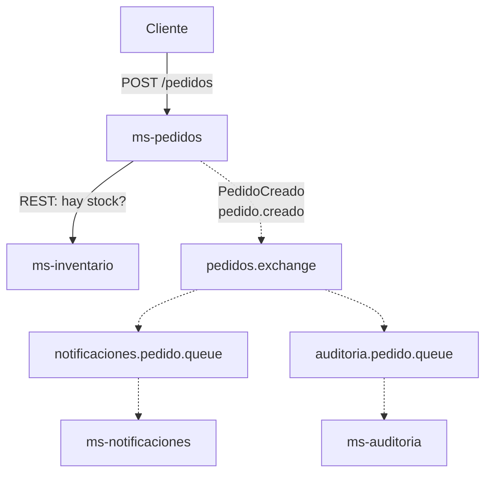

Línea continua: comunicación síncrona. Línea punteada: comunicación asíncrona por RabbitMQ.

---

# Parte 2 · Implementación

## 13. Qué hice

Armé cuatro aplicaciones con Spring Boot (Java 17 y Maven), cada una en su propia carpeta del repositorio. RabbitMQ lo corrí en Docker con la imagen `rabbitmq:3-management`.

| Servicio | Carpeta | Puerto | Qué hace |
|---|---|---|---|
| ms-inventario | `ms-inventario/` | 8081 | Responde si hay stock (con una lista fija en memoria) |
| ms-pedidos | `ms-pedidos/` | 8080 | Recibe el pedido, consulta el stock y publica el evento |
| ms-notificaciones | `ms-notificaciones/` | 8082 | Consumer de `notificaciones.pedido.queue` |
| ms-auditoria | `ms-auditoria/` | 8083 | Consumer de `auditoria.pedido.queue` |

Para hacer las pruebas usé `curl`, que hace el papel del "Cliente" del diagrama.

## 14. Preparar el entorno

Primero revisé que tenía instalados Java, Maven y Docker:

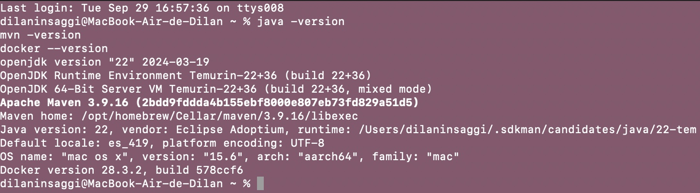

Después levanté RabbitMQ con Docker:

```bash
docker run -d --name rabbit -p 5672:5672 -p 15672:15672 rabbitmq:3-management
```

El puerto 5672 es el que usan las aplicaciones para conectarse a RabbitMQ y el 15672 es el del panel web (RabbitMQ Management).

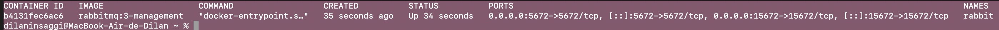

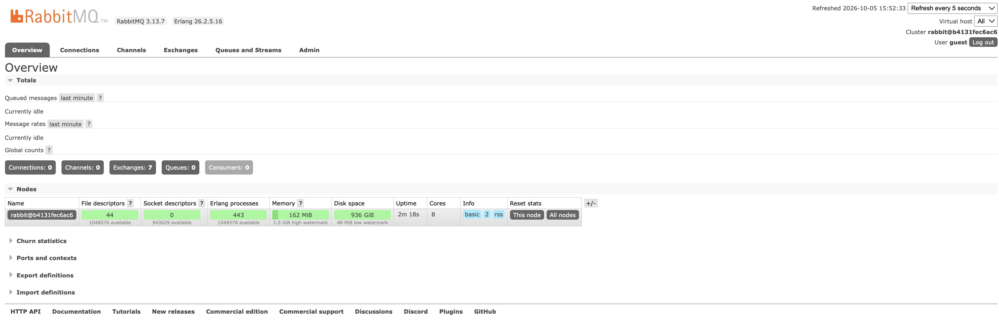

## 15. Comunicación síncrona: ms-pedidos → ms-inventario

ms-inventario tiene un endpoint `GET /inventario/{productoId}` que dice si hay stock suficiente. Para no complicarlo usé una lista fija: PROD-1 tiene 10 unidades, PROD-2 tiene 0 y PROD-3 tiene 5. PROD-2 lo dejé en 0 a propósito para probar el rechazo.

```java
private static final Map<String, Integer> STOCK = Map.of(
        "PROD-1", 10, "PROD-2", 0, "PROD-3", 5);

@GetMapping("/inventario/{productoId}")
public Map<String, Object> consultar(@PathVariable String productoId,
                                     @RequestParam(defaultValue = "1") int cantidad) {
    int disponible = STOCK.getOrDefault(productoId, 0);
    return Map.of("productoId", productoId, "disponible", disponible,
                  "hayStock", disponible >= cantidad);
}
```

Probé el servicio directo, con un producto que tiene stock y otro que no:

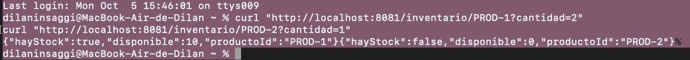

## 16. Configuración de RabbitMQ (exchange, colas y bindings)

Dejé la parte de mensajería separada de la lógica del negocio, en una clase aparte de ms-pedidos llamada `RabbitConfig`. Ahí declaro el exchange, las dos colas y los bindings, con los mismos nombres que puse en el diseño:

```java
public static final String EXCHANGE = "pedidos.exchange";
public static final String ROUTING_KEY = "pedido.creado";
public static final String QUEUE_NOTIFICACIONES = "notificaciones.pedido.queue";
public static final String QUEUE_AUDITORIA = "auditoria.pedido.queue";

@Bean
public TopicExchange pedidosExchange() { return new TopicExchange(EXCHANGE); }

@Bean
public Binding bindingNotificaciones() {
    return BindingBuilder.bind(notificacionesQueue()).to(pedidosExchange()).with(ROUTING_KEY);
}

@Bean
public Binding bindingAuditoria() {
    return BindingBuilder.bind(auditoriaQueue()).to(pedidosExchange()).with(ROUTING_KEY);
}
```

Cuando arranca ms-pedidos, Spring crea todo esto solo en RabbitMQ. En el panel se ve el exchange con tipo topic:

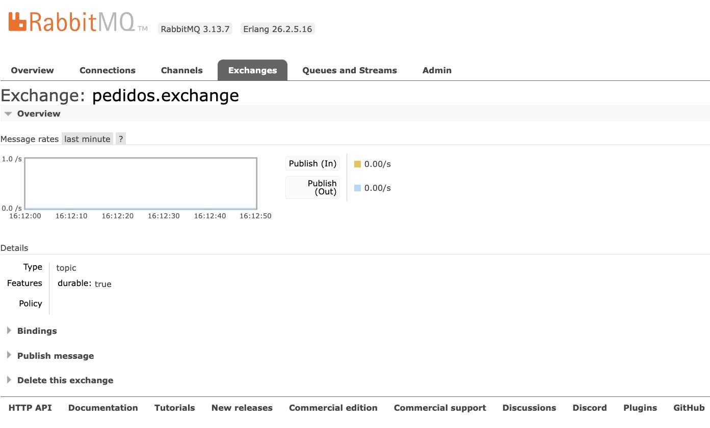

Y sus bindings, con la routing key `pedido.creado` hacia las dos colas:

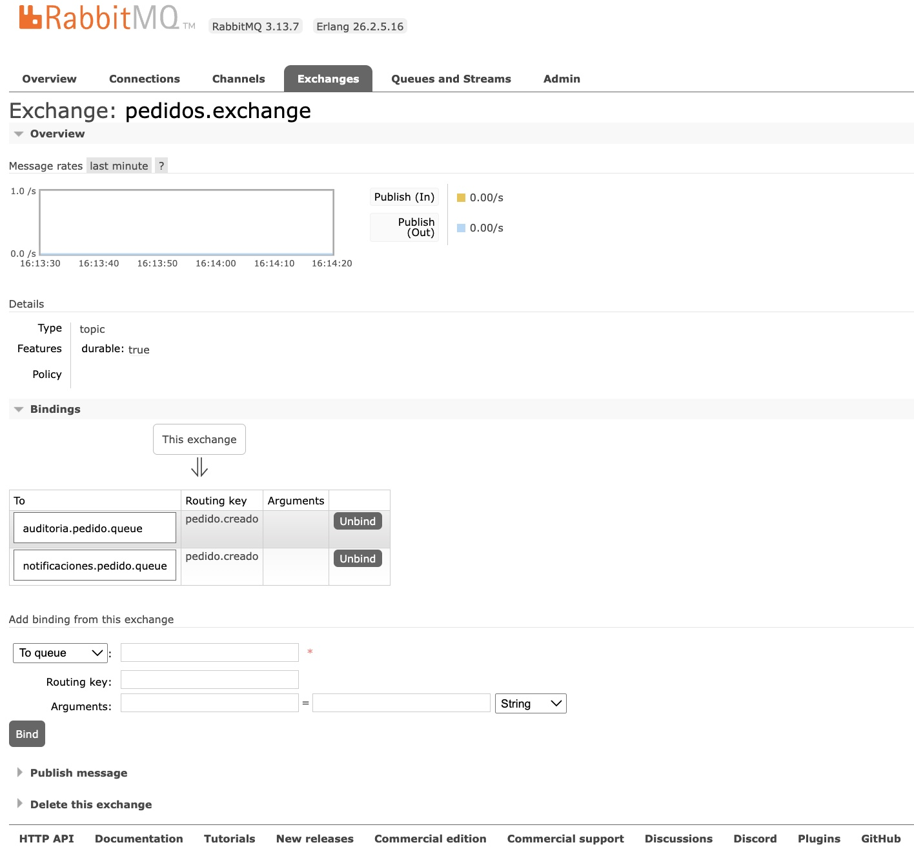

## 17. Producer y lógica del pedido (ms-pedidos)

El producer lo separé en dos clases. `PedidoEventPublisher` solo entrega el mensaje al exchange con la routing key, sin saber nada de las colas ni de quién lo va a recibir:

```java
public void publicarPedidoCreado(String payloadJson) {
    rabbitTemplate.convertAndSend(RabbitConfig.EXCHANGE, RabbitConfig.ROUTING_KEY, payloadJson);
}
```

`PedidoController` tiene la lógica. Primero hace la llamada **síncrona** a ms-inventario y espera la respuesta. Si no hay stock, responde 409 y no publica nada. Si hay, crea el pedido, publica el evento **sin esperar** a nadie y responde 201:

```java
Map<?, ?> stock = inventarioClient.get()
        .uri("/inventario/{id}?cantidad={c}", pedido.productoId(), pedido.cantidad())
        .retrieve().body(Map.class);
boolean hayStock = stock != null && Boolean.TRUE.equals(stock.get("hayStock"));

if (!hayStock) {
    return ResponseEntity.status(409).body(Map.of("error", "Sin stock suficiente", ...));
}
...
publisher.publicarPedidoCreado(payload);
return ResponseEntity.status(201).body(Map.of("pedidoId", pedidoId, "estado", "CREADO", ...));
```

El mensaje que se publica es el mismo payload del diseño: `pedidoId`, `clienteEmail`, `total` y `fechaCreacion`.

## 18. Consumers

Cada consumer solo dice de qué cola lee con `@RabbitListener`. No conocen a ms-pedidos, y por eso quedan desacoplados:

```java
// ms-notificaciones
@RabbitListener(queues = "notificaciones.pedido.queue")
public void recibir(String mensaje) {
    log.info("[NOTIFICACIONES] Mensaje recibido de notificaciones.pedido.queue: {}", mensaje);
    log.info("[NOTIFICACIONES] Simulando envío de correo al cliente...");
}

// ms-auditoria
@RabbitListener(queues = "auditoria.pedido.queue")
public void recibir(String mensaje) {
    log.info("[AUDITORIA] Mensaje recibido de auditoria.pedido.queue: {}", mensaje);
    log.info("[AUDITORIA] Registro del pedido guardado (simulado).");
}
```

## 19. Pruebas y recorrido del mensaje

### Pedido aceptado

Hice un `POST /pedidos` con PROD-1 y cantidad 2. ms-pedidos consultó el stock a ms-inventario, aceptó el pedido (respuesta 201, pedido 1001) y publicó el evento. En la captura se ven juntas la respuesta del `curl` y los logs de ms-pedidos, donde aparece la consulta de stock y la publicación en `pedidos.exchange` con la routing key `pedido.creado`:

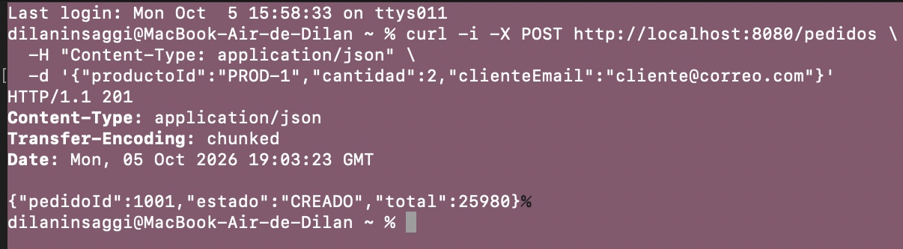

### Pedido rechazado por falta de stock

Con PROD-2, que tiene stock 0, la consulta síncrona hace que el pedido se rechace con un 409. No se publica ningún evento, porque el pedido nunca llegó a crearse:

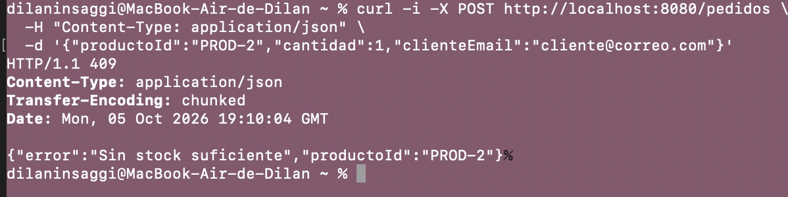

### Mensajes esperando en las colas

El primer pedido lo hice con los consumers todavía apagados. En RabbitMQ Management cada cola quedó con 1 mensaje en "Ready". Esto muestra el desacoplamiento: el pedido se creó y el mensaje quedó esperando aunque nadie lo estaba escuchando.

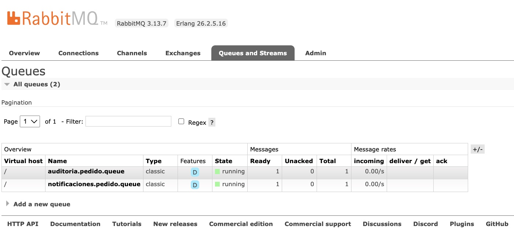

### Los consumers reciben el evento

Cuando arranqué los consumers, cada uno recibió el mensaje del pedido 1001 que estaba esperando. Después hice un pedido nuevo (1002, con PROD-3) y los dos lo recibieron al instante. O sea que el mismo evento llegó a los dos consumers, cada uno por su propia cola.

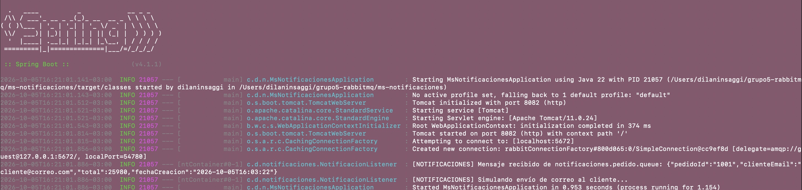

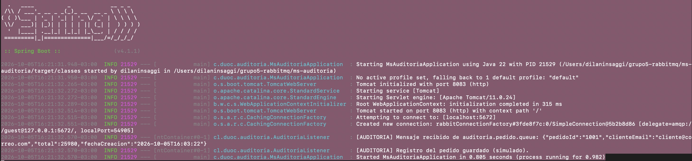

### Colas vacías después de consumir

Cuando los consumers procesaron los mensajes, las dos colas quedaron con 0 en Ready y 0 en Unacked. Comparando con la captura anterior de las colas, donde había 1 mensaje, se ve que los mensajes fueron consumidos:

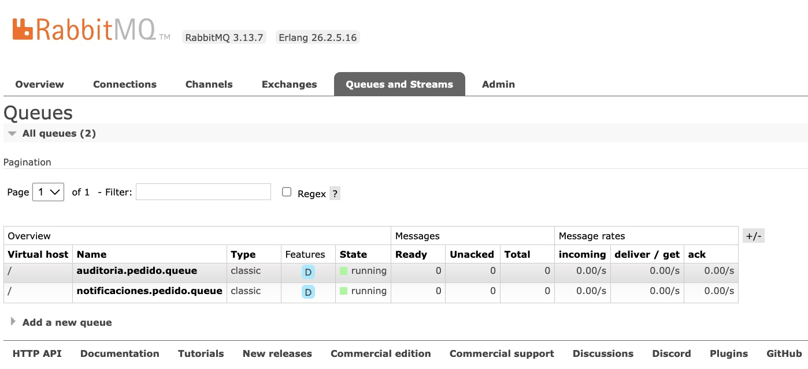

## 20. Recorrido completo de una operación

```
POST /pedidos
→ ms-pedidos recibe la solicitud
→ consulta síncrona a ms-inventario (REST)
→ si hay stock, el pedido se acepta (201)
→ ms-pedidos publica PedidoCreado
→ pedidos.exchange (topic)
→ routing key pedido.creado + bindings
→ notificaciones.pedido.queue y auditoria.pedido.queue
→ ms-notificaciones y ms-auditoria procesan el mensaje
```

## 21. Conclusión

La consulta de stock tiene que ser síncrona porque ms-pedidos necesita esa respuesta para decidir si acepta o rechaza el pedido. La notificación y la auditoría pueden ser asíncronas porque pasan después de que el pedido ya fue aceptado y no cambian lo que se le responde al cliente.

Lo que más me sirvió para entenderlo fue dejar los consumers apagados y ver el mensaje esperando en la cola: ms-pedidos funcionó igual aunque los otros servicios no estuvieran disponibles, y cuando se encendieron recibieron el mensaje sin perder nada.

No implementé reintentos, DLQ ni idempotencia, porque la actividad dice que todavía no son necesarios.
