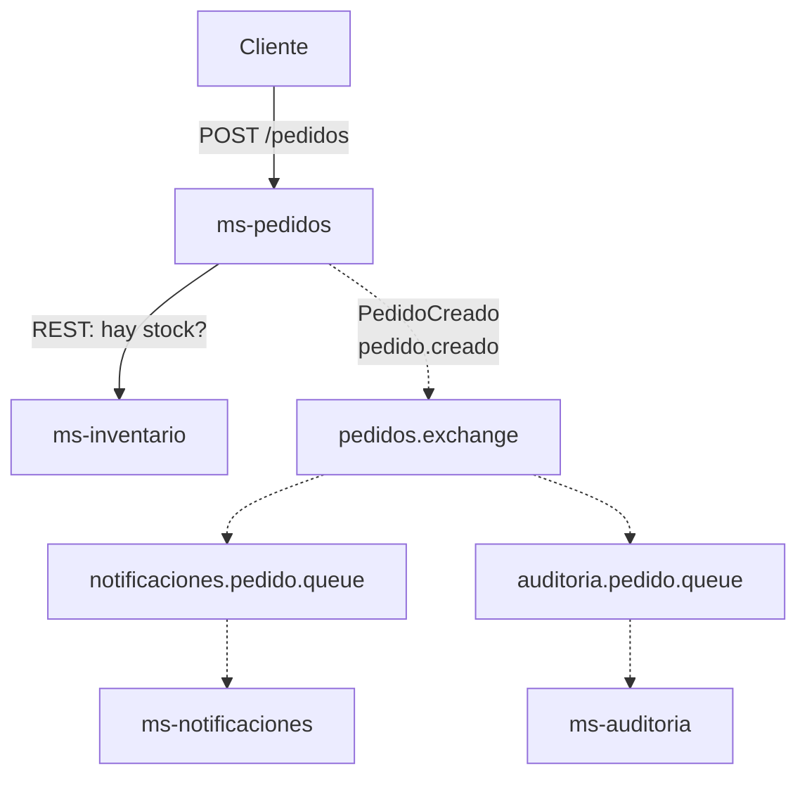

# Actividad evaluada RabbitMQ · Parte 1: Diseño

**Alumno:** Dilan Fuentes

## 1. Problema o contexto

Elegí hacer un sistema de pedidos para una tienda online. Cuando un cliente hace un pedido, lo primero es revisar si hay stock. Si hay, el pedido se acepta, y después hay que avisarle al cliente y dejar un registro de lo que pasó.

Con este ejemplo quiero mostrar que no todo en el flujo tiene que esperar. Revisar el stock sí tiene que ser inmediato, pero avisar al cliente y guardar el registro se puede hacer después, sin hacerlo esperar.

## 2. Microservicios

- **ms-pedidos:** recibe el pedido del cliente, consulta el stock y publica el evento cuando el pedido se acepta.
- **ms-inventario:** responde si hay stock de un producto.
- **ms-notificaciones:** avisa al cliente que su pedido fue recibido (en este trabajo se va a simular con un mensaje en consola).
- **ms-auditoria:** guarda un registro de los pedidos creados.

## 3. Flujo principal

1. El cliente envía un `POST /pedidos` a ms-pedidos.
2. ms-pedidos le pregunta a ms-inventario si hay stock.
3. Si no hay stock, responde un error al cliente y el flujo termina ahí.
4. Si hay stock, ms-pedidos acepta el pedido y le responde al cliente.
5. ms-pedidos publica el evento `PedidoCreado` en RabbitMQ.
6. ms-notificaciones y ms-auditoria reciben el evento y hacen su trabajo cada uno por su lado.

## 4. Comunicación síncrona

**ms-pedidos → ms-inventario (REST/HTTP):** consulta de stock.

## 5. Comunicaciones asíncronas

1. **ms-pedidos → RabbitMQ → ms-notificaciones:** aviso al cliente.
2. **ms-pedidos → RabbitMQ → ms-auditoria:** registro del pedido.

Las dos salen del mismo evento (`PedidoCreado`).

## 6. Justificación de cada clasificación

**Consulta de stock (síncrona):** ms-pedidos necesita la respuesta para decidir si acepta o rechaza el pedido. Sin esa respuesta no puede seguir, por eso tiene que esperar.

**Notificación (asíncrona):** se envía cuando el pedido ya fue aceptado. El cliente no debería esperar a que se mande un correo para recibir su respuesta. Además, si ms-notificaciones está caído, el pedido igual se crea y el mensaje queda esperando en la cola.

**Auditoría (asíncrona):** el registro no cambia el resultado del pedido y se puede hacer con un poco de retraso, así que no tiene sentido que bloquee al cliente.

Usar RabbitMQ en estos dos casos desacopla los servicios: ms-pedidos no necesita conocer quién consume el evento ni esperar a que terminen.

## 7. Evento

**PedidoCreado:** indica que un pedido fue aceptado correctamente.

## 8. Producer

ms-pedidos.

## 9. Consumers

- ms-notificaciones
- ms-auditoria

## 10. Configuración de RabbitMQ

| Elemento | Valor |
|---|---|
| Exchange | `pedidos.exchange` (tipo topic) |
| Routing key | `pedido.creado` |
| Queue 1 | `notificaciones.pedido.queue` |
| Queue 2 | `auditoria.pedido.queue` |
| Binding 1 | `notificaciones.pedido.queue` ← `pedidos.exchange` con `pedido.creado` |
| Binding 2 | `auditoria.pedido.queue` ← `pedidos.exchange` con `pedido.creado` |

Usé dos colas, una por consumer, porque si los dos leyeran de la misma cola, cada mensaje lo recibiría solo uno de ellos. Con una cola para cada uno, los dos reciben su copia del evento.

Elegí exchange tipo topic porque permite agregar más eventos después (por ejemplo `pedido.cancelado`) sin tener que cambiar al producer.

## 11. Payload mínimo

```json
{
  "pedidoId": "1001",
  "clienteEmail": "cliente@correo.com",
  "total": 25990,
  "fechaCreacion": "2026-10-02T10:30:00"
}
```

## 12. Diagrama de arquitectura



Línea continua: comunicación síncrona. Línea punteada: comunicación asíncrona por RabbitMQ.
